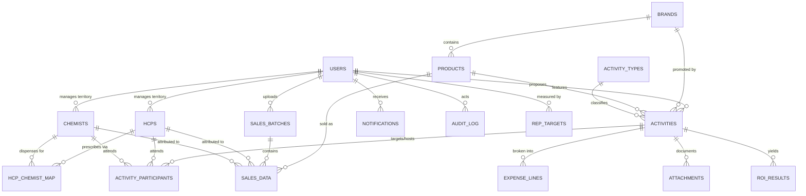

# Database Design

Engine: SQLite (MVP, via built-in `node:sqlite`) → PostgreSQL (production; schema is portable ANSI SQL).
Conventions: TEXT ids (business codes), `YYYY-MM` month keys, ISO-8601 timestamps, soft flags as INTEGER 0/1.

## ER Diagram

## Data Dictionary (MVP tables)

### users
| col | type | notes |
|---|---|---|
| id | TEXT PK | e.g. `EMP001` |
| name, email | TEXT | email UNIQUE |
| password_hash | TEXT | bcrypt |
| role | TEXT | `sales` \| `ho` (effective group) |
| sub_role | TEXT | MR/TM/AM/RM/PM/MktHead/Finance/Admin |
| territory, region, country | TEXT | scoping |
| manager_id | TEXT FK users | Phase-2 approval chains |
| active | INT | |

### hcps
id PK, name, qualification, speciality, clinic, address, city, territory, rep_id FK, class (A/B/C/Hospital), potential_score INT, registration_no, contact, verified INT, active INT, created_by, created_at.

### chemists
id PK, name, address, city, rep_id FK, is_hospital_in_house INT, verified INT, active INT.

### hcp_chemist_map
hcp_id + chemist_id composite PK; weight REAL default 1.0 (Phase-2 weighted attribution).

### brands / products
brands: id PK, name, therapy_area, active. products: id PK, brand_id FK, name, pack, sku, unit_price REAL, active.

### activity_types
id PK, name, default_budget_cap REAL, requires_attendance INT.

### activities
| col | type | notes |
|---|---|---|
| id | TEXT PK | `ACT-xxxxx` |
| title, objective, remarks | TEXT | |
| type_id FK, brand_id FK, product_id FK | TEXT | |
| proposed_by | TEXT FK users | owner |
| territory | TEXT | denormalized for scoping |
| planned_date, venue | TEXT | |
| estimated_cost REAL, expected_hcp_count INT, expected_sales REAL | | |
| status | TEXT | draft/submitted/approved/returned/rejected/executed/closed |
| decided_by, decided_at, decision_remarks | TEXT | HO decision |
| actual_date, actual_venue, actual_cost REAL, completion_remarks | | execution |
| created_at, updated_at | TEXT | |

### activity_participants  *(the actual-HCP mapping module)*
activity_id FK + account_id + account_type('hcp'|'chemist') composite PK; proposed INT, invited INT, attended INT, remarks TEXT. A row may be proposed-only, attended-only, or both — the diff powers the discrepancy audit.

### expense_lines
id INTEGER PK AUTOINCREMENT, activity_id FK, category (enum of 9), amount REAL, vendor, invoice_no.

### attachments
id PK AUTO, activity_id FK, kind (invoice/photo/attendance/presentation/other), filename, uploaded_by, uploaded_at. (MVP stores metadata + data URL; Phase 2 → S3 keys.)

### sales_batches
id PK AUTO, uploaded_by FK, uploaded_at, filename, month, row_count INT, status (committed/rolled_back).

### sales_data
id PK AUTO, batch_id FK, month `YYYY-MM`, employee_id FK, hcp_id FK NULL, chemist_id FK NULL, brand_id, product_id, quantity REAL, sales_value REAL, prescription_count INT, source, remarks. Indexes: (month), (hcp_id, month), (chemist_id, month), (batch_id).

### rep_targets
rep_id + month PK, target REAL, achieved REAL.

### roi_results (cache)
id PK AUTO, scope ('activity'|'hcp'|'employee'|'brand'), scope_id, model ('before_after'), window_months INT, computed_at, cost REAL, baseline_sales REAL, post_sales REAL, incremental REAL, roi_pct REAL, details JSON.

### notifications
id PK AUTO, user_id FK, type, message, entity_type, entity_id, read INT, created_at.

### audit_log  *(append-only)*
id PK AUTO, at, user_id, action, entity_type, entity_id, before_json, after_json, ip.

### config
key PK, value — e.g. `roi_window_months=3`, `gross_margin_pct=70`, `overrun_threshold_pct=110`, `gift_cap_per_hcp=5000`.

## Postgres migration deltas (Phase 2)
UUID or identity PKs, `NUMERIC(14,2)` money, `TIMESTAMPTZ`, monthly partitioning on `sales_data`, materialized views `mv_monthly_kpis` / `mv_doctor_roi`, RLS policies keyed on `tenant_id` (Phase 3), FK constraints enforced (SQLite MVP enforces at service layer + PRAGMA foreign_keys).
